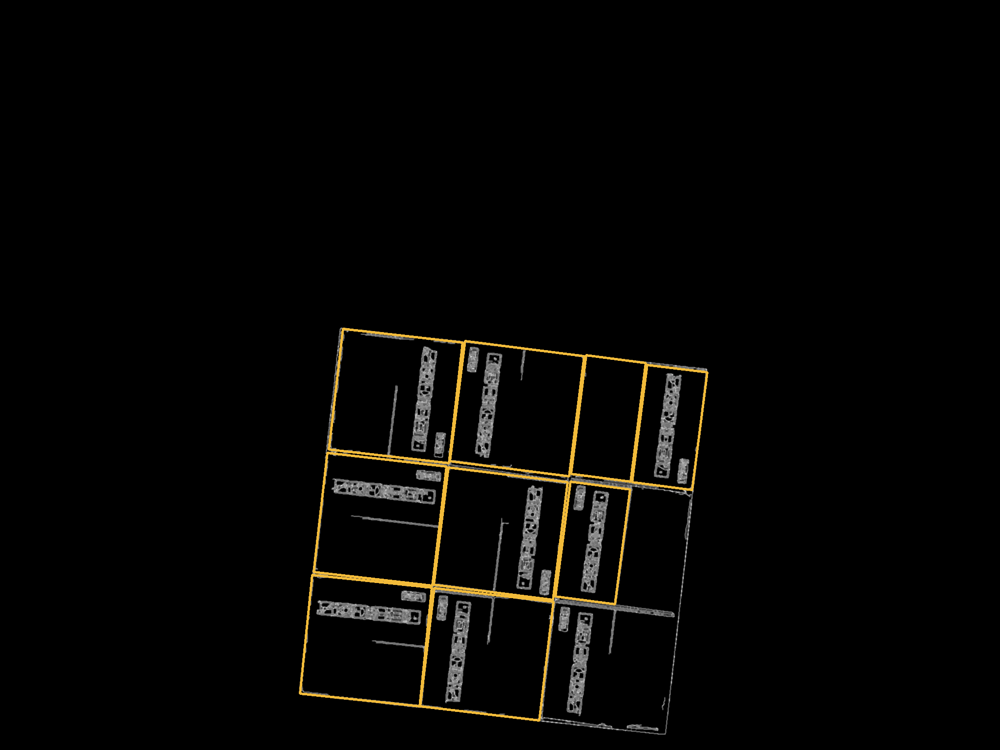
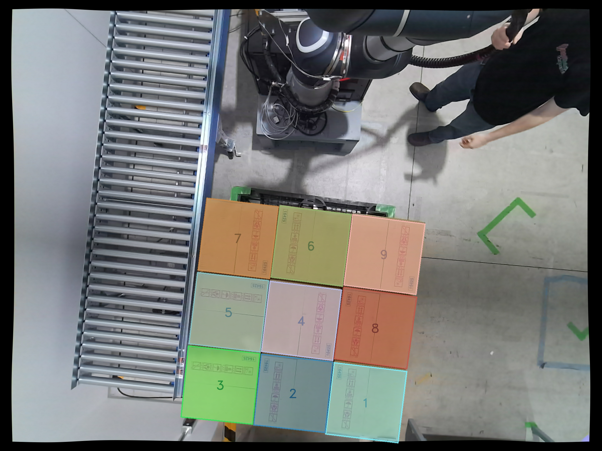

# Telexistence Take Home Assignment
<p align="center">
  
</p>

## Data-driven AI-based box detection

This project implements a deep learning pipeline for training an instance segmentation model to detect the upper surfaces of boxes. The design focuses modularity, flexibility and efficiency to ensure that the pipeline can scale with larger datasets whle maintaining ease of use.

### Dependencies
To ensure seamless execution, this project requires several dependencies, which are listed in the `requirements.txt` file. These include: 
- PyTorch and TorchVision: For implementing and training the Mask R-CNN model with a ResNet50 backbone.
- Pillow and OpenCV: For image loading, processing, and augmentations.
- TensorBoard: For logging and visualizing training metrics such as loss.
- TQDM: For monitoring progress during training loops.
- NumPy: For numerical operations, particularly in annotation handling.
- Open3D: Used in the second part of the assignment. Needed for the Python script to convert point cloud `.pkl` files to binaries readable in C++.

To install these dependencies, the following command is used:
```
pip install -r requirements.txt
```

### How to train
The training pipeline is designed to be user-friendly while incorporating modular components for flexibility. Follow these steps to train the model:

### 1. Prepare the dataset
The pipeline assumes a structured dataset located in the `Data/` folder. Each `.png` image must have a corresponding `.json` annotation file in LabelMe format. The annotations define polygons outlining the box surfaces, enabling the model to learn instance segmentation.

### 2. Run the training script
To begin training, execute the `train.py` script:
```
cd src/python
python train.py
```
The script automatically loads the dataset, applies augmentations, initializes the model with a pretrained backbone, and begins training with configurable parameters such as batch size and learning rate. If a NVIDIA GPU is detected, the training process leverages GPU acceleration, significantly speeding up computation by utilizing CUDA.

### 3. Training outputs
Model weights will be saved periodically in the `weights/` directory to allow recovery or fine-tuning at later stages. Training metrics such as loss will be logged in Tensorboard and stored in `runs/` folder for visualization.

### 4. Monitor training with Tensorboard
TensorBoard integration provides a visual interface for monitoring training progress:
```
tensorboard --logdir=runs
```
This interface displays loss curves and other metrics, helping users evaluate model performance and adjust hyperparameters as needed.

### Design decisions
The choice of Mask R-CNN with a ResNet50 backbone provides a strong baseline for instance segmentation tasks. The pretrained backbone accelerates convergence, leveraging features learned from large-scale datasets like ImageNet.

Regarding the augmentation pipeline, it includes horizontal flips, rotations, and color adjustments, enhancing generalization by exposing the model to varied data distributions.

Periodic saving of model weights ensures robustness, allowing recovery in case of interruptions. TensorBoard logging facilitates real-time monitoring of training metrics, enabling iterative improvements.

### Limitations and future improvements

While effective, the current augmentations are relatively static and may not fully mimic real-world variations. Other more computationally intensive augmentations could be added, such as random cropping, perspective transformations, and synthetic noise injection. These could simulate real-world variations like occlusions, distortions, or sensor noise, further improving the model's robustness and adaptability to challenging scenarios.

Additionally, the ResNet50 backbone limits adaptability to specific use cases requiring lighter or heavier architectures. Also, the model's performance heavily relies on dataset quality and diversity. Errors or inconsistencies in annotations can degrade results.

Future improvements could include incorporating synthetic data generation and domain adaptation techniques to improve generalization to unseen scenarios, or introducing active learning pipelines to iteratively refine annotations and improve model robustness.

## Classical CV-based box detection

For the second task, the program has been written in C++ with an OOP approach and consists of a simple interface that enables the user to process either single images or all the images in a certain folder. The program first masks the RGB images using depth data to segment the pallet with the boxes from the surrouding elements. Then, the preprocessing stage also involves Canny edge detection to ease the contour box detection as an initial approach to try to get all the boxes. Since it was observed after different parameters tuning that some boxes were misdetected, the following steps consist of filtering the detected boxes and inferring the missing boxes using a Monte Carlo method and clustering. Next, it is indicated how to install the dependencies and run the program, as well as further details in the algorithm implementation and potential further improvements.

### Dependencies

In order to run the program you will need to have installed OpenCV, Eigen3 and Point Cloud Library (PCL 1.13, since 1.12 gives a segmentation fault error with the point cloud visualization):

### 1. Install OpenCV
```
sudo apt update
sudo apt install libopencv-dev
```

### 2. Install Eigen3
```
sudo apt install libeigen3-dev
```

### 3. Install PCL 1.13
The `libpcl-dev` package available via `sudo apt install` typically provides version 1.12 of the Point Cloud Library. This is enough to run the program but not to visualize the point cloud without causing errors. To install PCL version 1.13, you will need to build it from source:
```
git clone --branch pcl-1.13.0 https://github.com/PointCloudLibrary/pcl.git
cd pcl
mkdir build
cd build
cmake -DCMAKE_BUILD_TYPE=Release ..
make -j$(nproc)
sudo make install
```

### How to execute the program
From the repository folder, navigate to the build directory, run CMake and compile the code. Finally, run the executable:
```
mkdir build
cd build
cmake ..
make
./box_segmentation
```

You will then be asked to enter if you want to process either a single image or all the images in the `Data/` folder. In case you enter `single` you will then be asked to specify the particular image file. Note that in order to be able to read the point cloud file in C++, you need to create the binary files from the `.pkl` Python-generated files, which are not directly processable by C++. In order to do this you should execute first the Python script named `pkl_to_bin.py` in the `src/python` folder. The input images and point clouds will be taken from the `Data/` folder and the output images will be saved in the newly created `Results/` folder in case the `saveIntResults` flag is set to true. `viewPCL` flag enables to visualize the segmented point cloud for each image if set to true. The folder paths as well as the flags can be modified in the `main.cpp` file.

### Algorithm explanation
The main program consists of two stages: the preprocessing stage carried out by the `Preprocessor.cpp` class and the detecting and segmenting stage, carried out by the `BoxDetector.cpp` class. 

### 1. Preprocessing
The preprocessing stage consists of two phases: first, creating a mask over the image to avoid detecting boxes on external objects that are not located on the pallet using the depth camera information; and second, preprocessing the image to detect the edges and prepare it for better box contour detection (Canny edge detection, Gaussian blur, dilation and erosion).

### 1.1. Masking the image with depth info
After extracting the point cloud, it is down-sampled to lower computational load and some outliers are initially removed. Then, three planes are detected using RANSAC algorithm (this number enables to detect the boxes top faces plane, the floor and a self in case there is one (see image 1.png)). Each of these detected planes is filtered again to remove outliers and it is then checked if it has a rectangle aspect ratio typical of a pallet (around 1.2) using PCA. They are additionally filtered by their average depth (since the self and the floor are either higher or lower than the boxes top face by a good margin). If a plane is found then the 2D projected mask from the segmented 3D point cloud is calculated and applied to the original image. In case this plane is not found due to the intrinsic statistical nature of the RANSAC algorithm, the masking stage runs again. The masked image are saved in the `Results/masked/` folder.

<p align="center">
  
  
</p>

### 1.2. Gaussian blurring, edge detection, dilation and erosion
The preprocessing stage enhances the input image to optimize the box detection by applying channel-wise edge detection and post-processing operations. First, the image is split into its three color channels and then each channel undergoes a Gaussian blur followed by Canny edge detection to extract prominent edges. The edge-detected channels are then combined, resulting in a unified edge map. Then, the combined edge map is again blurred and dilated to expand and connect nearby edges. Finally, erosion is applied to refine the edges by removing small artifacts. The resulting image is saved in `Results/edges/`.

<p align="center">
  
  
  
</p>

### 2. Box detection

The box detection stage processes the edge-detected image to identify, filter, and infer missing boxes. This stage consists of four key steps: initial box detection, detected boxes filtering, missing boxes inferring, and box segmentation. These processes are implemented in the `BoxDetector.cpp` class.

### 2.1. Initial box detection
Initially the edge-detected image identifies contours representing potential boxes. Each contour is approximated to a rotated rectangle to determine its geometric properties such as area and aspect ratio. Boxes are filtered based on their area (discarding very small or very large contours) and aspect ratio to exclude non-box-like shapes. Overlapping or nested boxes are handled by checking whether a box is inside an already detected box or if smaller boxes are contained within a new box. The remaining valid boxes are stored as detected boxes, while larger contours potentially representing pallet areas are stored separately. The detected boxes are drawn in yellow on the images saved in the `Results/det_boxes/` folder.

<p align="center">
  
  
  
</p>


### 2.2. Detected boxes filtering
This filtering stage further refines the detected boxes based on additional geometric constraints. Candidate pallet boxes are filtered by checking if their angle is within a defined deviation from the most common angle (calculated across all detected boxes). Other boxes are filtered based on their proximity to the average aspect ratio and angle of the detected boxes. Additionally, potential box flaps that might form a valid box when merged are combined and checked against the same geometric constraints. This ensures robust filtering of false positivies while retaining valid boxes. Filtered boxes are drawn in red and the pallet box in blue and are saved in `Results/det_boxes/`.
<p align="center">
  
  
</p>


### 2.3. Missing boxes inferring
This method addresses cases where some boxes might not have been detected. Using a Monte Carlo approach, random points are sampled within the pallet area. Points outside the existing detected boxes are clustered using a DBSCAN-based clustering algorithm implemented in the `ClustersProcessor` class. The estimated number of clusters corresponds to the number of missing boxes. For each cluster, its centroid and bounding dimensions are computed using principal components and geometric projections. The boxes are drawn from the cluster's closest detected segment. The resulting box dimensions and positions are validated against aspect ratio and area constraints before being added to the detected boxes and saved in the `Results/inferred_boxes/` folder.
<p align="center">
  
  
</p>

### 2.4. Segment boxes
In the final step, a segmentation mask is applied to visually highlight the detected boxes. Each box is assigned a unique color, and its mask is draw on the image. Borders of the boxes are drwan and their numbers are displayed at their respective centers. The segmented image is then blended with the original input to create a final overlay, highlighting all detected boxes with their contours and labels and saved in `Results/output/` folder.
<p align="center">
  
  
  
</p>

### Limitations and future improvements

The current implementation provides a good initial framework for detecting and segmenting palletized boxes, achieving acceptable results in some scenarios. However, some limitations remain. The system heavily depends on depth camera data for pallet segmentation and it may sometimes lead to inconsistent plane detection in challenging environments. Sensitivity to lighting, occlusions, and manual parameter tuning limits adaptability, while DBSCAN-based clustering assumes uniform box arrangements, reducing effectiveness for irregular layouts.

Future enhancements could include adaptive parameter tuning for broader generalization, optimized performance for real-time processing or better error management. Machine learning models could complement or replace traditional methods, improving detection and inference.

